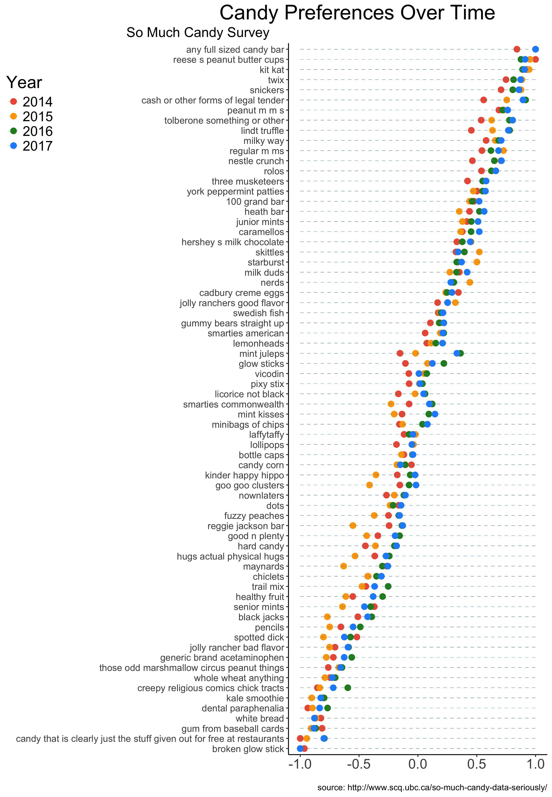
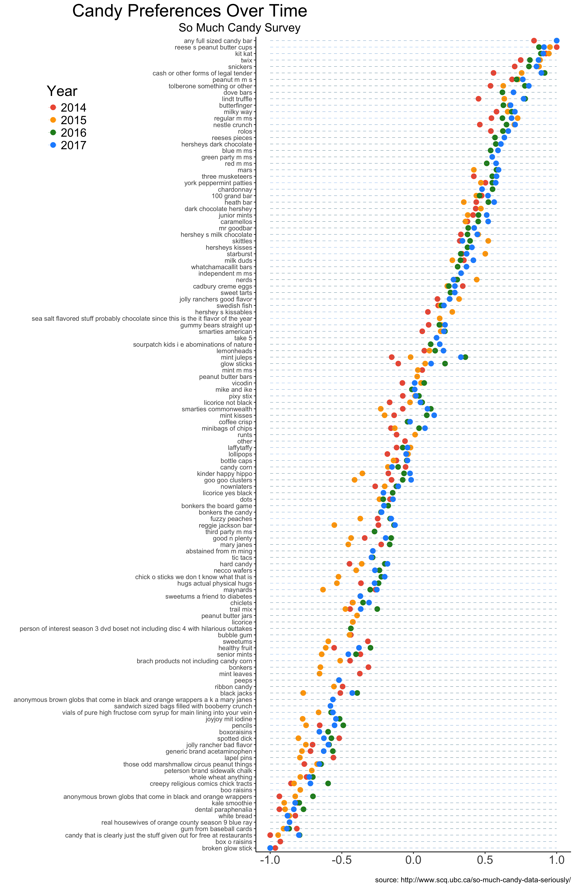

```{r setup, include=FALSE}
knitr::opts_chunk$set(echo = TRUE)
library(janitor)
# library(skimr)
library(readr)
library(stringr)
library(reshape2)
library(readxl)
library(ggplot2)
library(dplyr)

## Set colors
## import colors to use
bright= c(red=rgb(222,45,38, maxColorValue=255), #de2d26
          pink=rgb( 255, 102, 153, maxColorValue=255), #ff6699
          orange=rgb(232,121,12, maxColorValue=255),   #e8790c
          yellow=rgb(255,222,13, maxColorValue=255), #ffde0d          
          green=rgb(12,189,24, maxColorValue=255),  #0cbd18           
          teal=rgb(59,196,199, maxColorValue=255), #3bc4c7
          blue=rgb(58,158,234, maxColorValue=255), #3a9eea
          purple=rgb(148,12,232, maxColorValue=255)) #940ce8  
```

# Introduction: So Much Candy 

These data can be dowloaded by year [here](http://www.scq.ubc.ca/so-much-candy-data-seriously/); however, the code below also includes lines to download each dataset. For each year, the 
“Net Feelies” metric is calculated as : (=#JOY-#DESPAIR)

# Data Wrangling

## 2017

```{r 2017, warning=FALSE, message=FALSE} 
## download data from the Internet
if(!file.exists('candyhierarchy2017.csv')) {
  system('wget http://www.scq.ubc.ca/wp-content/uploads/2017/10/candyhierarchy2017.csv')
}

## read data into R
candy17 <- read_csv("candyhierarchy2017.csv")
names(candy17) <- names(candy17) %>% str_replace_all("\\\\xd5", "")
candy17 <- as.data.frame(candy17)

## determine which columsn we're interested in
cols_to_summarize <- grep("Q6", colnames(candy17)) 

## let's clean up those columns
df <- candy17[,cols_to_summarize] %>% clean_names() 
colnames(df) <- gsub("q6_","",colnames(df))

## function to summarize despair and joy
summary_function <- function(x){
  a <- tabyl(x) %>% 
    melt(id="x") %>% 
    select(value) %>% 
    t() 
  return(a)
}

## get the names of all the columns we'll have in our output object
## who knows why I did it this way ¯\_(ツ)_/¯
x <- df[,2]
nameit <- tabyl(x) %>%
  melt(id="x") %>%
  mutate(category = paste0(x,"_",variable)) %>%
  select(category)

## run function to summarize joy and despair
output17 <- as.data.frame(t(apply(df, 2, summary_function)))
colnames(output17) <- nameit$category

## calculate net feelies
feelies17 = as.data.frame(as.numeric(output17$JOY_n - output17$DESPAIR_n))
rownames(feelies17) <- rownames(output17)

```

## 2016

```{r 2016, warning=FALSE, message=FALSE}
## download data from the Internet
if(!file.exists('BOING-BOING-CANDY-HIERARCHY-2016-SURVEY-Responses.xlsx')) {
  system('wget https://www.scq.ubc.ca/wp-content/uploads/2016/10/BOING-BOING-CANDY-HIERARCHY-2016-SURVEY-Responses.xlsx')
}

## read data into R
candy16 <- read_excel("BOING-BOING-CANDY-HIERARCHY-2016-SURVEY-Responses.xlsx") %>% clean_names()
candy16 <- as.data.frame(candy16)
candy16 <- candy16[, !apply(is.na(candy16), 2, all)]

## get the columns you're interested in
cols_to_summarize <- grep("x_", colnames(candy16)) 
df16 <- candy16[,cols_to_summarize]
colnames(df16)<-gsub("x_","",colnames(df16))

## use that function from above to summarize joy and despair for each item
output16 <- as.data.frame(t(apply(df16, 2, summary_function)))
colnames(output16) <- nameit$category

## calculate net_feeles
feelies16 = as.data.frame(as.numeric(output16$JOY_n - output16$DESPAIR_n))
rownames(feelies16) <- rownames(output16)

```

## 2015

```{r 2015, warning=FALSE, message=FALSE}
## download data from the Internet
if(!file.exists('CANDY-HIERARCHY-2015-SURVEY-Responses.xlsx')) {
  system('wget https://www.scq.ubc.ca/wp-content/uploads/2015/10/CANDY-HIERARCHY-2015-SURVEY-Responses.xlsx')
}

## read data into R
candy15 <- read_excel("CANDY-HIERARCHY-2015-SURVEY-Responses.xlsx") %>% clean_names()

## get the columns you're interested in
cols_to_summarize <- grep("x_", colnames(candy15)) 
df15 <- as.data.frame(candy15[,cols_to_summarize])
colnames(df15)<-gsub("x_","",colnames(df15))

## see note in section above
x <- df15[,2]
nameit <- tabyl(x) %>%
  melt(id="x") %>%
  mutate(category = paste0(x,"_",variable)) %>%
  select(category)

## use that function from above to summarize joy and despair for each item
output15 <- as.data.frame(t(apply(df15, 2, summary_function)))
colnames(output15) <- nameit$category

## calculate net feelies
feelies15 = as.data.frame(as.numeric(output15$JOY_n - output15$DESPAIR_n))
rownames(feelies15) <- rownames(output15)
```

## 2014

```{r 2014, warning=FALSE, message=FALSE}
## download data from the Internet
if(!file.exists('CANDYDATA.xlsx')) {
  system('wget http://www.scq.ubc.ca/wp-content/uploads/2014/10/CANDYDATA.xlsx')
} 

## read data into R & clean it up a little
candy14 <- read_excel("CANDYDATA.xlsx") %>% clean_names %>%
  as.data.frame %>%
  filter(!is.na(item))
rownames(candy14) <- candy14$item
candy14 <- as.data.frame(t(candy14))
candy14<-clean_names(candy14)
colnames(candy14)<-gsub("x100","100",colnames(candy14))

candy14 <- as.data.frame(t(candy14))

## net feelies have already been calculated
feelies14 <- as.data.frame(as.numeric(as.character(candy14$net_feelies)))
rownames(feelies14) <- rownames(candy14)
```
# Every Year Data

Here, we're only looking at items included on each year's survey. Candy's that were not on every survey from 2014-2017 have been excluded.

## Merging & Scaling Data

To complete this analysis, all four years of "feelies" data are combined. They are then scaled within each year so that the most favorable candy (brings the most relative "JOY") receives a score of +1 while the least favorable (brings the most relative "DESPAIR") receives a score of -1. 

```{r data-merge}
## merge all these data together
combined <- merge(feelies14,feelies15,by="row.names") %>%
  merge(.,feelies16,by.x="Row.names",by.y="row.names") %>%
  merge(.,feelies17,by.x="Row.names",by.y="row.names")
combined <- as.data.frame(combined)

colnames(combined) <- c("row.names","x2014","x2015","x2016","x2017")

## scale all values between -1 and 1 within a year
scalefunc <- function(x){
  minx = min(x)
  maxx = max(x)
  val= 2*((x - minx)/(maxx - minx))-1
  return(val)
} 
out <- as.data.frame(apply(combined[,2:5],2,scalefunc))
out$row.names <- as.character(combined$row.names)

## calculate a few things we may use to order the graph
out$biggest_change <- out$x2016-out$x2015
out$abs_change <- abs(out$x2016-out$x2015)
out$sum <- rowSums(out[,1:4])
out <- out %>% arrange(sum)
```

## Data Visualization

Having calculated the scaled feelies metric, the data are then visualized.

```{r data-viz}
## tidy data format!
data <- melt(out, id.vars='row.names', variable.name='Year', 
             value.name="net_feelies") %>%
  mutate(item_name = gsub("_", " ",row.names))

## let's plot!
theme_set(theme_classic())
p <- ggplot(out, aes(x=factor(item_name,level=row.names))) + 
  geom_point(aes(y=x2014), col="tomato2", size=3) +   
  geom_point(aes(y=x2015), col="orange", size=3) + 
  geom_point(aes(y=x2016), col="springgreen", size=3) + 
  geom_point(aes(y=x2017), col="dodgerblue", size=3) + 
  scale_colour_manual("", 
                      breaks = c("2014", "2014", "2016", "2017"),
                      values = c("tomato2", "orange", "springgreen","dodgerblue")) +
  geom_segment(aes(x=item_name, 
                   xend=item_name, 
                   y=min(x2014), 
                   yend=max(x2014)), 
               linetype="dashed", 
               size=0.1) +   # Draw dashed lines
  labs(title="Candy Preferences Over Time", 
       subtitle="So Much Candy Survey", 
       caption="source: http://www.scq.ubc.ca/so-much-candy-data-seriously/",
       x="",y="") +  
  coord_flip() +
  guides(colour = guide_legend())


p1 <- data %>%
  filter(Year=="x2014" | Year=="x2015" | Year=="x2016" | Year=="x2017") %>%
  ggplot(., aes(x=factor(item_name,level=unique(item_name)), 
                y = net_feelies, color = Year)) +
  geom_point(size=3) +
  scale_colour_manual(
    labels = c("x2014"="2014", "x2015"="2015", 
               "x2016"="2016", "x2017"="2017"),
    values = c("x2014"="tomato2", "x2015"="orange", 
               "x2016"="forestgreen","x2017"="dodgerblue")) +
  geom_segment(aes(x=item_name, 
                   xend=item_name, 
                   y=min(net_feelies), 
                   yend=max(net_feelies)), 
               linetype="dashed", 
               size=0.1) +   # Draw dashed lines
  labs(title="Candy Preferences Over Time", 
       subtitle="So Much Candy Survey", 
       caption="source: http://www.scq.ubc.ca/so-much-candy-data-seriously/",
       x="",y="") +  
  coord_flip() +
  theme(legend.position = c(-1.0, 0.9), 
        legend.text=element_text(size=16),
        axis.text.x=element_text(size=16),
        axis.text.y=element_text(size=11),
        legend.title=element_text(size=20),
        plot.title=element_text(size=24,hjust = 4),
        plot.subtitle = element_text(size=16,hjust = -1.4))

ggsave(plot=p1, filename="images/candy_alldata.png", height=13,width=9,units=c("in"))

```



# All Data

Below, instead of limiting to those items that were incluced on the survey all four years, here we summarize all items, using the same process as above

## Merging & Scaling Data

The data are first merged and scaled within year.

```{r data-merge-all}

## merge all these data together
combined_all <- merge(feelies14,feelies15,by="row.names", all=TRUE) %>%
  merge(.,feelies16,by.x="Row.names",by.y="row.names", all=TRUE) %>%
  merge(.,feelies17,by.x="Row.names",by.y="row.names", all=TRUE)
combined_all <- as.data.frame(combined_all)
colnames(combined_all) <- c("row.names","x2014","x2015","x2016","x2017")

## scale all values between -1 and 1 within a year
scalefunc <- function(x){
  minx = min(x, na.rm=TRUE)
  maxx = max(x, na.rm=TRUE)
  val= 2*((x - minx)/(maxx - minx))-1
  return(val)
} 
out_all <- as.data.frame(apply(combined_all[,2:5],2,scalefunc))
out_all$row.names <- as.character(combined_all$row.names)

## calculate a few things we may use to order the graph

## calculate sum, normalized by number of years question was asked
out_all$sum <- rowSums(out_all[,1:4],na.rm=TRUE)
isNA <- function(x){sum(is.na(x))}
out_all$isNA <- apply(out_all,1,isNA)
out_all$sum_NA <- out_all$sum/(4-out_all$isNA) 
out_all <- out_all %>% arrange(sum_NA)

```

## Data Visualization

The data are then visualized.

```{r data-viz-all}
## tidy data format!
data_all <- melt(out_all, id.vars='row.names', 
                 variable.name='Year', value.name="net_feelies") %>%
  mutate(item_name = gsub("_", " ",row.names))

## let's plot!
p2 <- data_all %>%
  filter(Year=="x2014" | Year=="x2015" | Year=="x2016" | Year=="x2017") %>%
  ggplot(., aes(x=factor(item_name,level=unique(item_name)), y = net_feelies, color = Year)) +
  geom_point(size=3) +
  scale_colour_manual(
    labels = c("x2014"="2014", "x2015"="2015", 
               "x2016"="2016", "x2017"="2017"),
    values = c("x2014"="tomato2", "x2015"="orange", 
               "x2016"="forestgreen","x2017"="dodgerblue")) +
  geom_segment(aes(x=item_name, 
                   xend=item_name, 
                   y=-1, 
                   yend=1), 
               linetype="dashed", 
               size=0.1) +   # Draw dashed lines
  labs(title="Candy Preferences Over Time", 
       subtitle="So Much Candy Survey", 
       caption="source: http://www.scq.ubc.ca/so-much-candy-data-seriously/",
       x="",y="") +  
  coord_flip() +
  theme(legend.position = c(-0.6, 0.9),
        legend.text=element_text(size=16),
        axis.text.x=element_text(size=16),
        axis.text.y=element_text(size=9),
        legend.title=element_text(size=20),
        plot.title=element_text(size=24,hjust = -2.3),
        plot.subtitle = element_text(size=16,hjust = -0.4))

ggsave(plot=p2, filename="images/candy_alldata_allcandy.png", height=17,width=11,units=c("in"))

```


